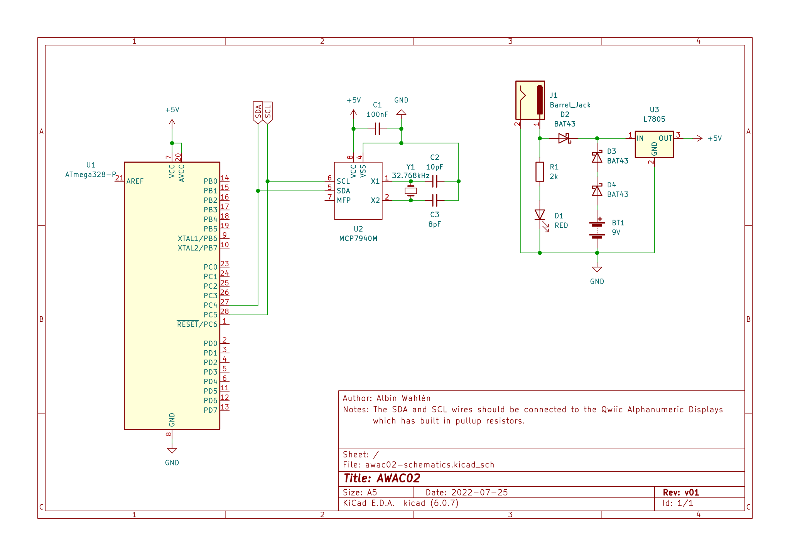

# Documentation

## Source Files

In this section an overview of the project files are given.
The files are listed in order of relevance.

| File(s)                  | Description |
|--------------------------|-------------|
| `main.c`                 | The main file. |
| `constants.h`            | Global constants for defining number of displays, enabling logging etc. |
| `log.h`, `log.c`         | Logging functions. Everything here will be unavailable if the LOG constant is undefined. |
| `clock.h`, `clock.c`     | High level functions to set and show the clock status. |
| `display.h`, `display.c` | Low level functions to interface with the Qwiic Alphanumeric Display |
| `time.h`, `time.S`       | Start and use the hardware times. |
| `twi.h`, `twi.S`         | Interface to the TWI (I2C) hardware. Read and write to external devices. |
| `flash.h`, `flash.S`     | Low level functions to load constant data from flash. For example an ASCII conversion table. |
| `io.h`, `io.S`           | Direct control of pins. |
| `usart.h`, `usart.S`     | Send data through USART. This is used to implement printf in `log.c` |
| `math.S`                 | Low level math for assembly routines. |

# Schematic
In this section the schematic is shown.

